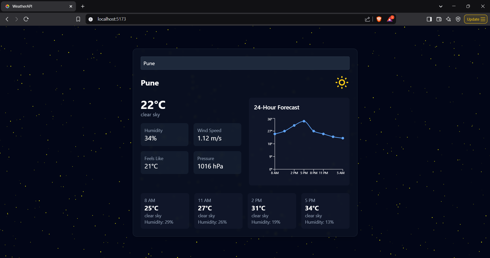

# Modern Weather Dashboard 🌦️

A sleek and responsive weather dashboard that provides real-time weather information with beautiful, dynamic backgrounds. Built with React, Vite, and TailwindCSS, featuring OpenWeather API integration.

## 🎯 Live Demo

[View Live Demo](https://weather-real-time-ochre.vercel.app/) - Live!

## ✨ Features

### Core Features
- 🌡️ Real-time weather data and conditions
- 📈 24-hour temperature forecast chart
- 🎨 Dynamic backgrounds based on weather
- 📱 Fully responsive design
- 🔍 Global city search
- 💨 Wind speed and direction
- 💧 Humidity levels
- 🌡️ "Feels like" temperature
- 🌪️ Pressure readings
  
### UI/UX Features
- ✨ Particle effects for clear weather
- 🌧️ Animated grid patterns for rain
- ❄️ Snowfall effect for snowy conditions
- ☁️ Cloud patterns for overcast weather
- 🎭 Smooth transitions between states
- 📊 Interactive temperature charts

## 🛠️ Built With
- [React](https://reactjs.org/) - UI Framework
- [Vite](https://vitejs.dev/) - Build Tool
- [TailwindCSS](https://tailwindcss.com/) - Styling
- [OpenWeather API](https://openweathermap.org/api) - Weather Data
- [Recharts](https://recharts.org/) - Charts
- [Framer Motion](https://www.framer.com/motion/) - Animations
- [TailwindCSS Animate](https://github.com/jamiebuilds/tailwindcss-animate) - CSS Animations

## 🚀 Getting Started

### Prerequisites

- Node.js (v14 or higher)
- npm or yarn
- OpenWeather API key

### Installation

1. Clone the repository
2. Install dependencies (npm install)
3. Start the development server (npm run dev)
   
## 📦 Project Structure
weather-dashboard/
├── public/
│   ├── favicon.jpeg
├── src/
│   ├── components/
│   │   ├── WeatherCard.jsx
│   │   └── ui/
│   │       ├── grid-pattern.jsx
│   │       ├── grid-background.jsx
│   │       └── sparkles.jsx
│   │
│   ├── App.jsx
│   ├── main.jsx
│   └── index.css
│
├── .env
├── .gitignore
├── package.json
├── tailwind.config.js
├── vite.config.js
└── README.md

## 👏 Acknowledgments

- OpenWeather API for weather data
- Aceternity UI for background patterns
- TailwindCSS community
- React ecosystem maintainers

## 📧 Contact & Support

- Created by [Pranav Kamble]
- LinkedIn: [@yourhandle](https://www.linkedin.com/in/pranav-kamble-a92a99204)
- Email: Pvkamble02@gmail.com

